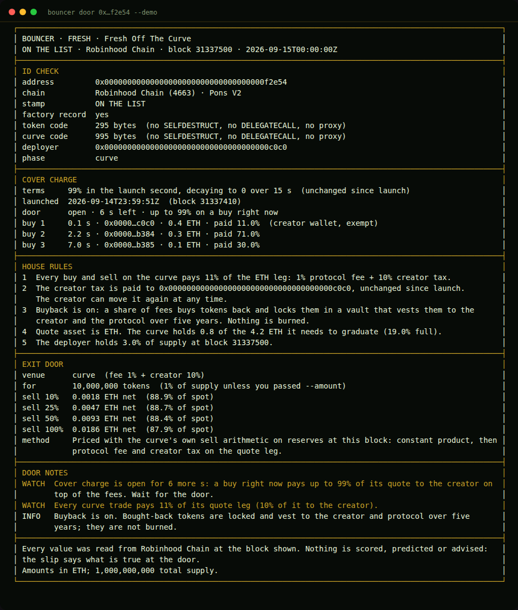
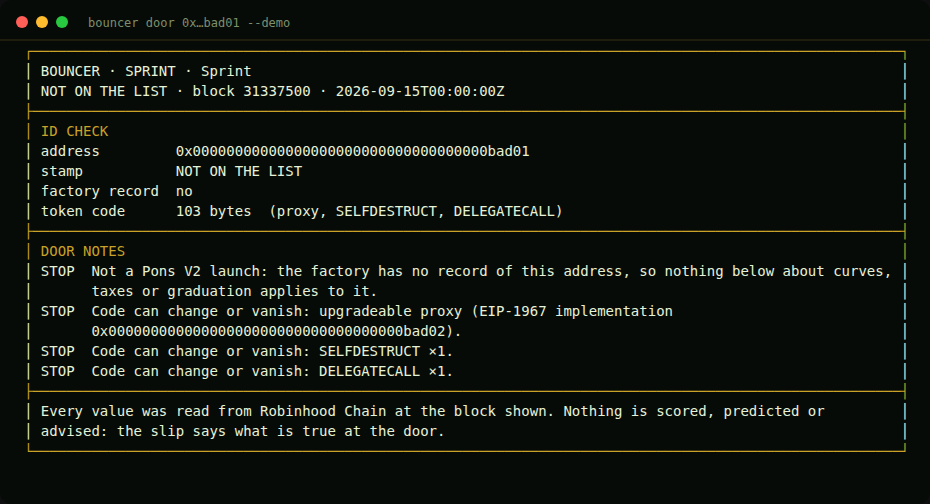
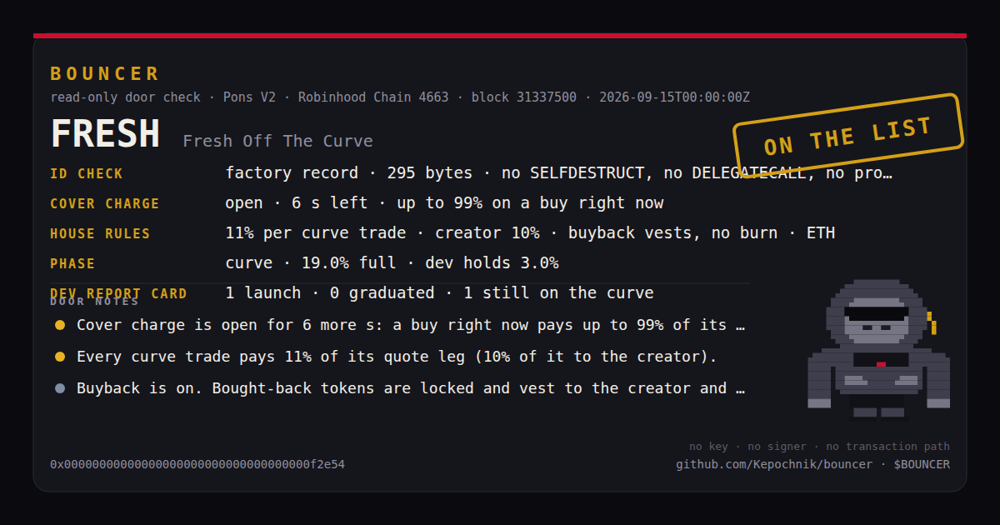
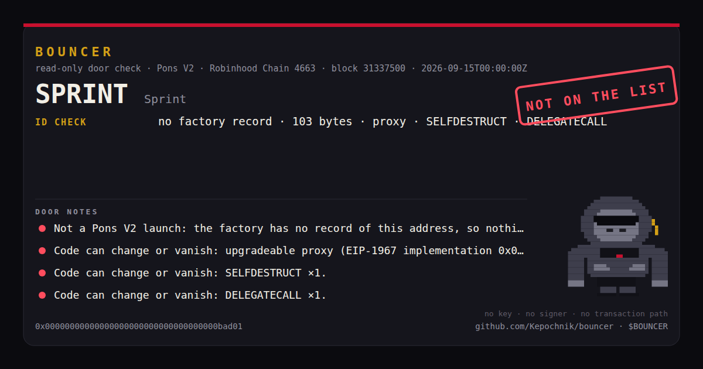
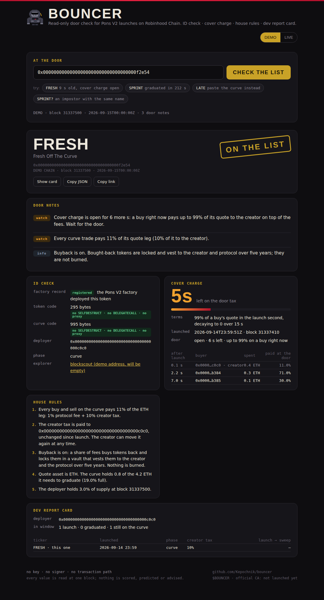
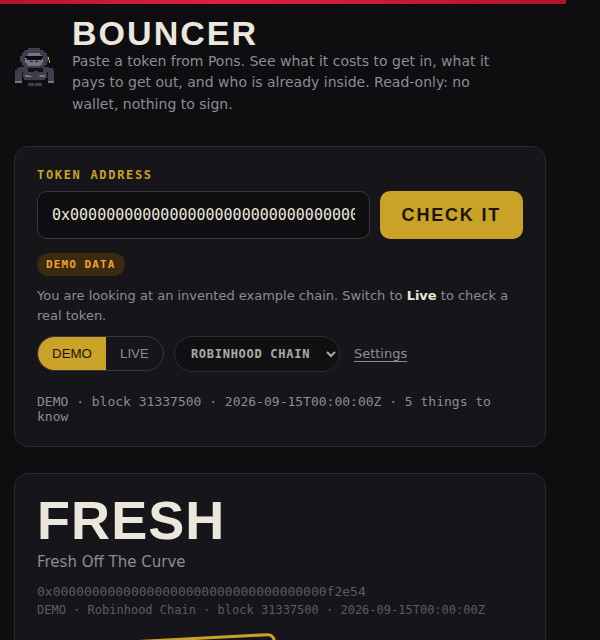

<p align="center"></p>

<h1 align="center">BOUNCER</h1>

<p align="center"><strong>Check the list before you pay the cover.</strong><br/>Read-only door check for Pons V2 launches on Robinhood Chain, and for Radian (the Pons V2 port) on Circle's Arc.</p>

<p align="center">
  
  
  
  
  
  
  <a href="LICENSE"></a>
</p>

<p align="center"><a href="#sixty-seconds">Sixty seconds</a> · <a href="#the-slip">The slip</a> · <a href="#the-site">The site</a> · <a href="#commands">Commands</a> · <a href="#watch">Watch</a> · <a href="#the-board">Board</a> · <a href="#mcp-server">MCP</a> · <a href="#arc">Arc</a> · <a href="#telegram-bot">Bot</a> · <a href="#browser-extension">Extension</a> · <a href="docs/RULES.md">Rules</a> · <a href="docs/CHAINS.md">Chains</a> · <a href="docs/LIMITATIONS.md">Limitations</a></p>

> **Official CA:** not launched yet. When it is, the address goes here first, then everywhere else. Anything claiming to be `$BOUNCER` before this line changes is not.

---

## Why

Twenty-five thousand tokens launch on Pons every day. Each one has a door: a 99% anti-snipe tax that decays to zero over the first fifteen seconds, a creator tax of up to 10% on every trade, a fee recipient the creator can move, a "buyback" that vests back to the creator instead of burning, and a deployer with a history. None of that is on the chart. All of it is on the chain.

BOUNCER reads it and prints a slip: **ID check** (did the factory really deploy this token, and can its code change), **cover charge** (is the door tax still open, what did the buys inside the window actually pay), **house rules** (the terms in plain words), **the room** (who bought, how much the creator funded, buys landing in the same block), the **exit door** (what 10 / 25 / 50 / 100% of a position fetches right now, on the curve or in the graduated pool), **one crew** (which of the first buyers were funded by the same hand), **lookalikes** (other tokens with the same ticker, and which came first) and the **dev report card** (what this deployer launched before and how it went). The stamp says `ON THE LIST` or `NOT ON THE LIST`. The notes say what to read before paying. Older Pons V1 tokens (fixed supply, Uniswap V3 pool from block one) are on the list too, with their own rules.

For holders there is a **position** (one wallet on one launch: cost basis, fees and taxes paid, exit value now), a **receipt** (one trade itemised: protocol fee, creator tax, cover charge) and a **watch** (DEV MOVED: the deployer sold or moved tokens, the tax recipient moved, buyback flipped; CREW EXIT: the crew leaving together). For creators there is a **launch planner** (what a launch looks like under today's factory terms, before anything is signed). For everyone there is **the board** (tonight's deployers, serial launchers, cover charge collected and paid) and, for agents, a **read-only MCP server** with all of it as tools.

The gorilla is the meme. The slip is the product.

## Sixty seconds

Node 22.13 or newer. No runtime dependency: the ABI codec, keccak, JSON-RPC client and bytecode scanner are in `src/chain/`, small enough to read.

```bash
git clone https://github.com/Kepochnik/bouncer.git
cd bouncer
npm install
npm run demo          # three slips on a synthetic chain, labelled DEMO
npm run doctor        # rpc, chain id 4663, factory bytecode, anti-snipe terms
```

## The slip

```bash
node bin/bouncer.mjs door 0xTOKEN                  # or the curve address
node bin/bouncer.mjs door 0xTOKEN --format svg --output slip.svg
node bin/bouncer.mjs door 0xTOKEN --format json
```

A launch nine seconds old, cover charge still open, one wallet already paid 71% at the door:

<p align="center"></p>

A contract named after a real launch that the factory has never seen:

<p align="center"></p>

The card (1200×630), for the reply under "graduating tonight":

<p align="center"></p>

<p align="center"></p>

## Beyond the door

```bash
node bin/bouncer.mjs exit 0xTOKEN --amount 5000000          # exit door for a position
node bin/bouncer.mjs wallet 0xTOKEN 0xWALLET                # the bag: trades, cost basis, exit now
node bin/bouncer.mjs receipt 0xTXHASH                       # one trade itemised
node bin/bouncer.mjs plan --tax 300 --buy 0.1               # launch planner at today's terms
node bin/bouncer.mjs dev 0xDEPLOYER --hours 48              # dev report card alone
```

## Watch

```bash
node bin/bouncer.mjs watch 0xTOKEN --crew                   # one line per event, every 5 s, until you stop it
```

DEV MOVED: the deployer sold on the curve or moved tokens out, the creator moved the tax recipient or flipped buyback, the curve was swept or graduated. CREW EXIT (with `--crew`): two or more of the wallets ONE CREW found sharing a funder leaving in the same window. The same watch runs in the Telegram bot (`/watch`) and in a browser tab (the "Watch in this tab" button on any slip, with browser notifications if you allow them).

## The board

```bash
node bin/bouncer.mjs board --hours 1                        # deployers, serial launchers, cover charge by curve and by wallet
node bin/bouncer.mjs board --hours 24 --no-cover            # the deployer board alone (cheap)
```

Two boards over one window: deployers (launched, graduated, swept without a pool; serial launchers with nothing to show) and the cover charge (every buy on the chain in the window, the part of its tax above the curve's own creator rate, summed per curve and per payer). Counts and sums, not scores.

## MCP server

```bash
node bin/bouncer-mcp.mjs                                    # stdio; BOUNCER_DEMO=1 for the synthetic chain
```

```json
{ "mcpServers": { "bouncer": { "command": "node", "args": ["/path/to/bouncer/bin/bouncer-mcp.mjs"] } } }
```

Eight read-only tools, every one annotated `readOnlyHint`: `bouncer_check` (the slip), `bouncer_tax_now` (the cover charge right now), `bouncer_crew` (the room and the crew), `bouncer_dev` (the report card), `bouncer_receipt` (one trade itemised), `bouncer_exit` (the exit door), `bouncer_plan` (the launch planner) and `bouncer_board` (the board). Each returns a text block and `structuredContent`. No dependencies: the server speaks the stdio transport itself, one JSON-RPC message per line. An agent trading through Robinhood's rails, or anyone else's, can ask the door before it buys; nothing here can sign.

## The site

The same read path runs in the browser, bundled into one HTML file (`npm run site` → `site/dist/index.html`). Paste an address, get the slip, watch the cover charge count down, leave the tab watching for the dev to move. Demo mode needs no network; live mode reads the chain you pick from your browser through an RPC you choose. Tabs for the door, a deployer, a wallet, a receipt, the planner and the board. Every view has a link: `#/t/0x…` (add `?watch=1` to start watching), `#/dev/0x…`, `#/wallet/0xT/0xW`, `#/tx/0x…`, `#/plan?tax=300`, `#/board?hours=1`, with `?chain=arc-testnet` for Arc.

<p align="center"></p>

Deploys to GitHub Pages from `main` with `.github/workflows/pages.yml`.

## Commands

| Command | What it reads | What it prints |
| --- | --- | --- |
| `bouncer doctor` | `eth_chainId`, latest block, factory bytecode, `snipeTaxStartBps()`, `snipeTaxSeconds()` | read-path health |
| `bouncer door <token\|curve>` | factory record, bytecode and EIP-1967 slots of token and curve, `TokenLaunched` for the token, factory retune logs, the curve's buys and sells since launch, curve state or PoolManager storage, fee-recipient and buyback logs, Blockscout funding sources and token search, the deployer's `TokenLaunched` logs over the window | the slip |
| `bouncer door … --format svg` | the same | the card |
| `bouncer dev <address> [--hours 24]` | the deployer's `TokenLaunched` logs, each launch's record and symbol | the dev report card alone |
| `bouncer exit <token> [--amount n]` | curve reserves and fees, or the pool's slot0 and liquidity via `extsload` | what selling 10 / 25 / 50 / 100% pays now |
| `bouncer wallet <token> <wallet>` | the wallet's `CurveBuy`/`CurveSell`, `balanceOf`, the exit door | trades, cost basis, fees and taxes paid, exit value, unrealised |
| `bouncer receipt <txhash>` | the transaction receipt's curve logs, the factory record, reserves at that block | one trade itemised, cover charge separated |
| `bouncer plan [--config 0] [--tax 100] [--quote 0x…] [--buy 0.1]` | launch config, pair economics, launch fee, tax ceiling, anti-snipe terms, hook policy | start and graduation price, curve vs pool split, FDV at graduation, creator's take, door charge on a sample buy |
| `bouncer watch <token> [--interval 5] [--crew] [--rounds n]` | deployer's `CurveSell` and `Transfer`, factory events for the token, crew wallets' sells and transfers | one line per event, until stopped |
| `bouncer board [--hours 1] [--top 10] [--no-cover]` | factory launches, sweeps and graduations in the window; every `CurveBuy` on the chain in the window; `creatorTaxBps()` per curve | the board |
| `bouncer demo` | nothing (synthetic chain) | three slips offline |

Every command takes `--chain robinhood|arc-testnet|arc`, `--factory <address>`, `--rpc <url>`, `--demo`, `--format text|markdown|json` and `--output <new file>` (never overwrites). `door` also takes `--hours`, `--launch-blocks` and `--no-dev --no-room --no-crew --no-lookalikes --no-blockscout`.

## Arc

Radian is a faithful port of the Pons V2 contracts on Circle's Arc, quoted in native USDC. The read path is identical, so BOUNCER runs there with `--chain arc-testnet` (chain 5042002, Radian's published factory) today and `--chain arc --factory 0x…` on mainnet (chain 5042, opens 2026-09-16) as soon as Radian publishes its mainnet factory. The site has the same selector. Amounts print in USDC; the table of chains, RPCs, explorers and factories is [docs/CHAINS.md](docs/CHAINS.md).

## The proxy (when a public RPC refuses browsers)

Public RPCs often answer servers but not web pages ("Failed to fetch" in the browser). `proxy/` is a Cloudflare Worker that forwards read-only JSON-RPC and two explorer routes with CORS headers; nothing else passes. The hosted site uses `https://bouncer-proxy.tarasenkosanja12.workers.dev` by default (`DEFAULT_PROXY` in `site/src/app.ts`); your own copy of the site can point at your own worker via Settings → Proxy URL, or by deploying `proxy/` with `npx wrangler deploy` (or the `deploy-proxy` workflow with a `CLOUDFLARE_API_TOKEN` secret). Details in [proxy/README.md](proxy/README.md).

## Telegram bot

```bash
TELEGRAM_BOT_TOKEN=… BOUNCER_SITE_URL=https://kepochnik.github.io/bouncer node bin/bouncer-bot.mjs
```

Long polling, no webhook, no library. `/ca <token|curve>` prints the slip, `/dev <address>` the report card, `/exit <token> [tokens]` the exit door, `/board [hours]` the board, `/watch <token>` turns on DEV MOVED and CREW EXIT alerts for that chat (`/unwatch` stops them; set `BOUNCER_STATE_FILE=watches.json` to keep them across restarts), `/chain arc-testnet` switches chain for that chat. The bot holds one secret, its own token, and can only read.

## Browser extension

The whole site in a Chrome popup, with one thing a web page cannot do: an extension page may call any RPC directly, so the public endpoints answer it even when they refuse browser requests from a website. Open it on a token page (ponsfamily.com, gmgn.ai, dexscreener.com, the Blockscout explorers) and the slip for the address in the URL opens in live mode on the matching chain. A small `🦍 BOUNCER · check the list` badge is pinned on those pages too. It reads the page URL and nothing else: no wallet, no page storage, no injected requests.

<p align="center"></p>

**Install (Chrome, Brave, Arc, Edge; Manifest V3):**

1. Download `bouncer-extension.zip` from the site footer (or build it: `npm run site` writes `site/dist/bouncer-extension.zip`), or use the `extension/` folder of this repo as is.
2. Open `chrome://extensions`, turn on **Developer mode** (top right).
3. Drag the zip onto the page, or **Load unpacked** and pick the `extension/` folder.
4. Pin BOUNCER in the toolbar. Click it on any token page.

The popup keeps its own settings (chain, RPC, proxy, factory) in the extension's storage. Host permissions are narrowed to the chains' public endpoints; a custom RPC or proxy is requested from Chrome the moment you save it.

**Chrome Web Store:** everything the listing needs is in `extension/store/`: the listing text and permission justifications (`listing.md`), the privacy policy (`PRIVACY.md`, also published at `/privacy.html` on the site), the 128 px icon, a 1280×800 screenshot and a 440×280 promo tile (`node scripts/store-assets.mjs` regenerates them). Upload `site/dist/bouncer-extension.zip` at https://chrome.google.com/webstore/devconsole (one-time $5 developer registration), paste the texts, submit for review.

## Prior art, named

[PonsScan](https://github.com/argostroloji/ponsscan) and [PonsHQ](https://ponshq.com) show curve fill; [GRAID](https://github.com/0xfokki/graid) and [Augur](https://getaugur.xyz) score launches; [WORM](https://github.com/wormrobinhood/worm) runs a graduation feed; [HOP OUT](https://hopout.xyz) prices the exit from pool depth; [DIPLOMA](https://github.com/Kepochnik/diploma) prints the transcript after a graduation; [Radian](https://github.com/adrianhihi/radian) ported Pons V2 to Arc. BOUNCER stands at the door before any of that: it does not score, rank or predict. It reads the terms and the code and says what is true at one block.

## Read-only by construction

`npm run readonly-check` fails the build if anything in `src/` mentions `eth_sendRawTransaction`, `eth_sign`, `signTransaction`, a private key or a mnemonic. The RPC client refuses every method that is not on its read allow-list. The site has no wallet connect, no approval, no transaction path.

```text
No key. No signer. No transaction path.
```

## Project map

```text
bin/bouncer.mjs             CLI entry
bin/bouncer-bot.mjs         Telegram bot entry
bin/bouncer-mcp.mjs         MCP server entry
src/cli.ts                  commands
src/chain/                  keccak, ABI codec, JSON-RPC client, Pons V2 constants, block-pinned reader, event tape (plain + adaptive), bytecode scanner
src/bouncer/idCheck.ts      factory record, curve → token, bytecode and proxy slots
src/bouncer/coverCharge.ts  anti-snipe terms, window, observed buys
src/bouncer/houseRules.ts   the terms in words
src/bouncer/devReport.ts    the deployer's launches over a window
src/bouncer/room.ts         who bought, dev share, first minute, shared blocks
src/bouncer/exitDoor.ts     sell quotes on the curve or the graduated pool
src/bouncer/oneCrew.ts      funding sources of the first buyers (Blockscout)
src/bouncer/lookalike.ts    same-ticker tokens and which came first (Blockscout + factory)
src/bouncer/position.ts     one wallet on one launch
src/bouncer/txReceipt.ts    one trade itemised
src/bouncer/planner.ts      the launch planner
src/bouncer/watch.ts        DEV MOVED and CREW EXIT events, and the poll loop
src/bouncer/leaderboard.ts  the board
src/mcp/server.ts           the read-only MCP server (stdio, no dependencies)
src/bouncer/door.ts         one address in, one slip out; the door notes
src/bouncer/card.ts         the 1200×630 card
src/bouncer/demo.ts         synthetic chain and fake explorer for --demo
src/chain/chains.ts         Robinhood Chain, Arc Testnet, Arc
src/chain/blockscout.ts     the smallest Blockscout v2 client
src/bot/telegram.ts         the Telegram bot
extension/                  Manifest V3 browser extension
proxy/                      Cloudflare Worker: read-only JSON-RPC + explorer proxy with CORS
site/                       the browser app (index.html + src/app.ts), built by scripts/build-site.mjs
scripts/                    read-only check, mascot renderer, site build, terminal → SVG
test/                       offline tests against the demo chain
docs/                       RULES, LIMITATIONS, LAUNCH-KIT
```

## Tests

```bash
npm run check     # read-only check + build + 47 tests + site bundle, no network
```

## License

MIT. BOUNCER is independent of Robinhood, Pons, Radian, Circle and Uniswap and is not endorsed by them.
