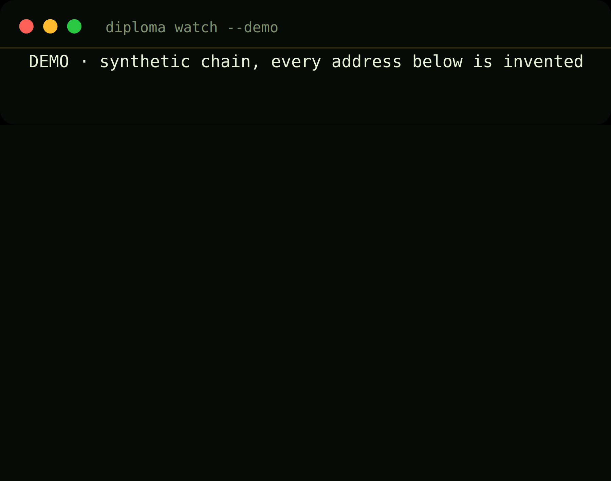
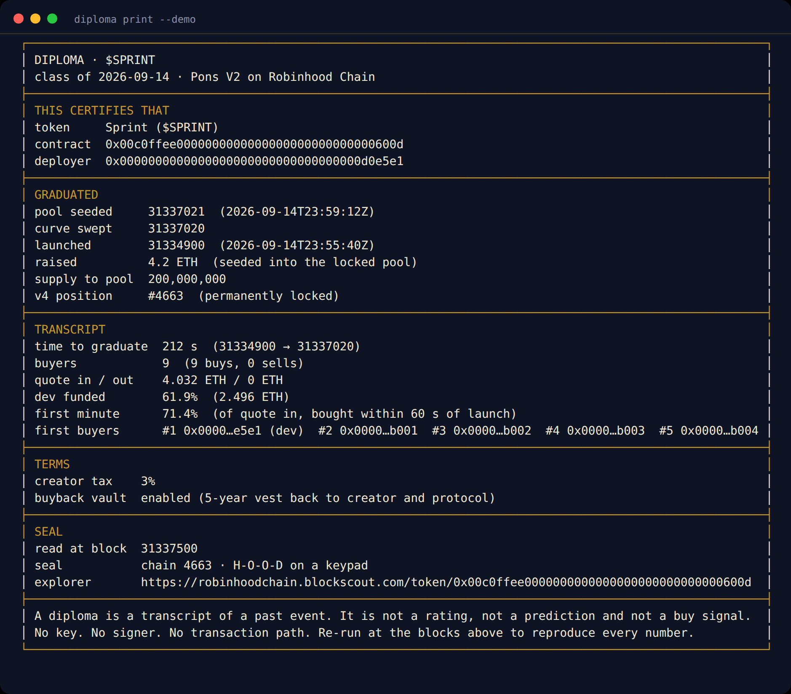
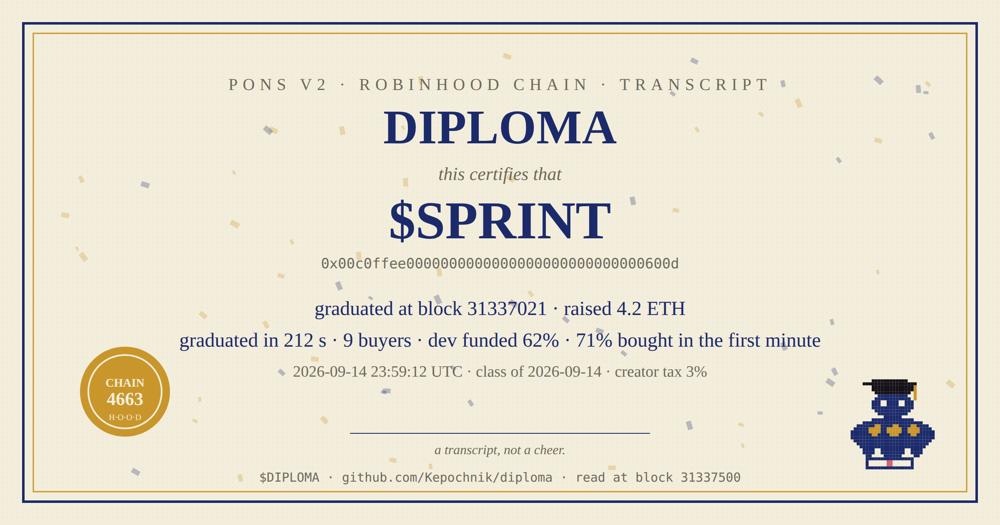
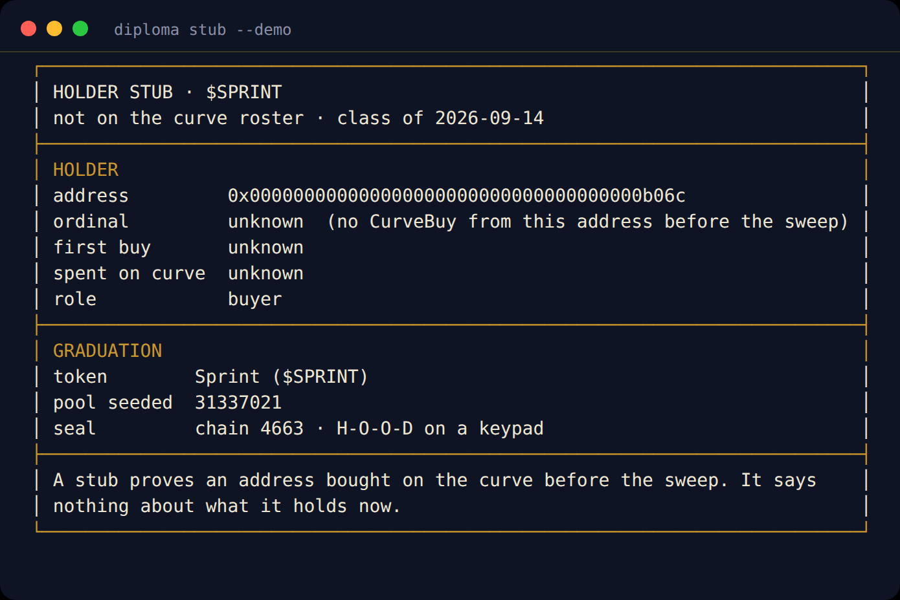
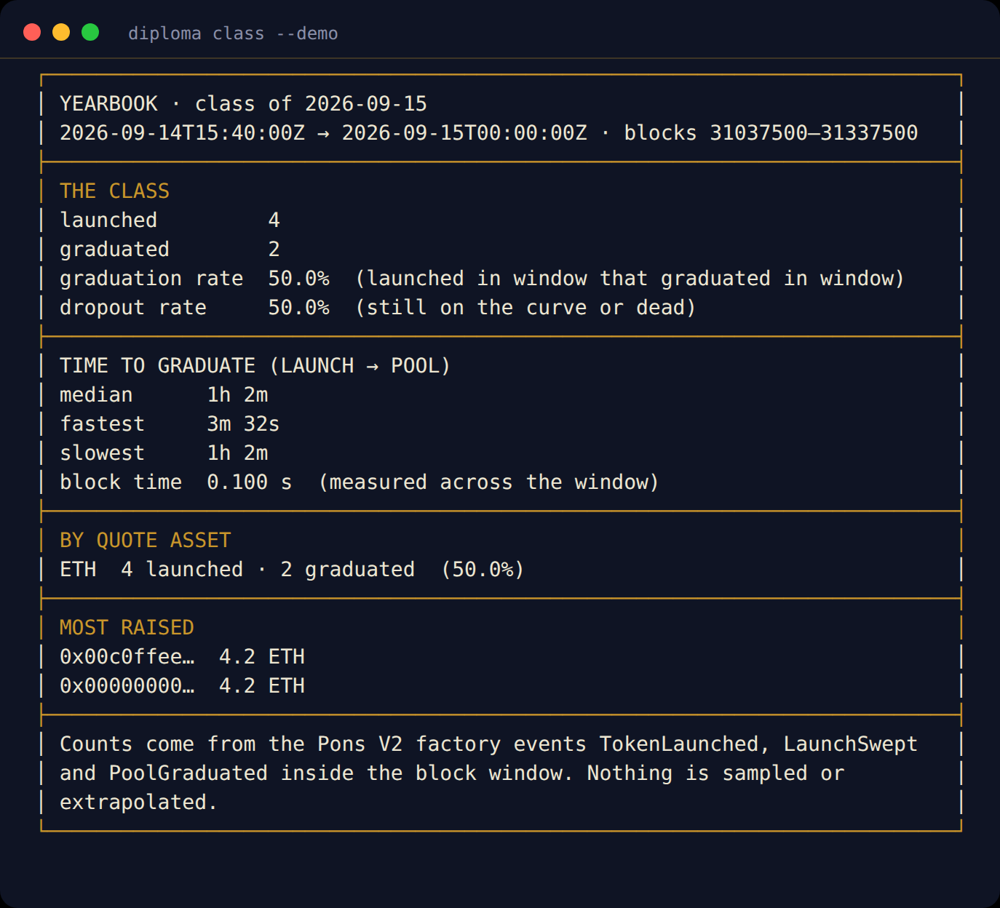
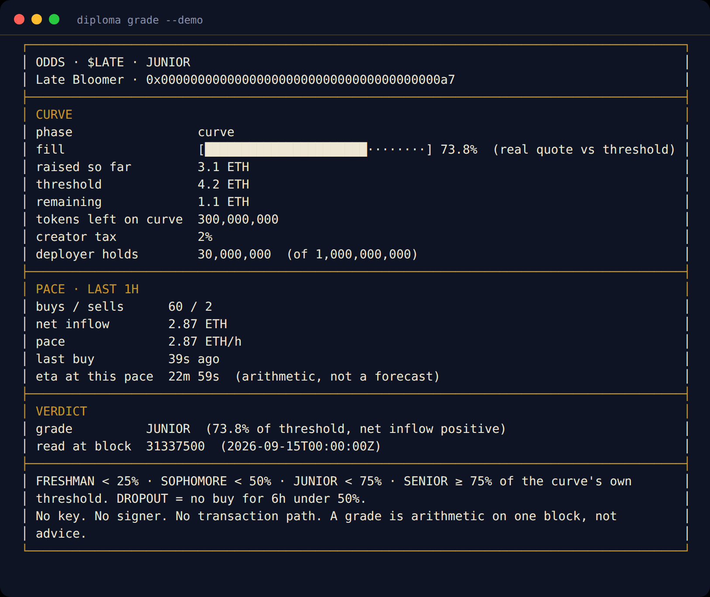
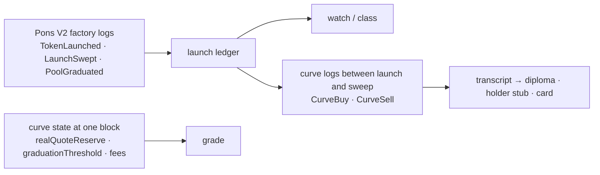

<p align="center"></p>

<h1 align="center">DIPLOMA</h1>

<p align="center"><strong>A transcript, not a cheer.</strong><br/>Read-only graduation desk for Pons V2 curves on Robinhood Chain.</p>

<p align="center">
  
  
  
  
  
  <a href="LICENSE"></a>
</p>

<p align="center"><a href="#sixty-seconds">Sixty seconds</a> · <a href="#the-diploma">The diploma</a> · <a href="#commands">Commands</a> · <a href="docs/RULES.md">Rules</a> · <a href="docs/LIMITATIONS.md">Limitations</a></p>

> **Official CA:** not launched yet. When it is, the address goes here first, then everywhere else. Anything claiming to be `$DIPLOMA` before this line changes is not.

---

## Why

Twenty-five thousand tokens launch on Pons every day and about one in a hundred graduates into a locked Uniswap V4 pool. Every dev says "graduating tonight". When one does, the only artifact is a chart.

Half of all Pons graduations complete within a few minutes of launch. Many of those are one dev buy, a handful of wallets and a sweep. Others are forty buyers over an hour. The chart looks the same. The transcript does not.

DIPLOMA reads the curve's own logs between launch and sweep and prints the transcript: **seconds to graduate, distinct buyers, the share the deployer funded, the share bought in the first minute, and the roster in order.** Then it puts the block number on the seal so anyone can re-run it and get the same paper.

The tortoise is the meme. The transcript is the product.

## Sixty seconds

Node 22.13 or newer. No other runtime dependency: the ABI codec, keccak and JSON-RPC client are in `src/chain/`, small enough to read.

```bash
git clone https://github.com/Kepochnik/diploma.git
cd diploma
npm install
npm run demo          # offline walkthrough on a synthetic chain, labelled DEMO
npm run doctor        # rpc, chain id 4663, factory bytecode, snipe tax terms
```

<p align="center"></p>

## The diploma

```bash
node bin/diploma.mjs print 0xTOKEN                       # transcript in the terminal
node bin/diploma.mjs print 0xTOKEN --format svg --output diploma.svg
node bin/diploma.mjs print 0xTOKEN --holder 0xYOURADDRESS  # "buyer #13 of 40"
```

<p align="center"></p>

Two graduations from the demo chain, same 4.2 ETH raised, same chart shape:

| | `$SPRINT` | `$SLOW` |
| --- | --- | --- |
| time to graduate | 212 s | 62 min |
| buyers | 9 | 40 |
| dev funded | 62% | 8% |
| bought in the first minute | 71% | 8% |

The card version (1200×630, cream paper, navy ink, the seal reads `4663`, which is `H-O-O-D` on a phone keypad):

<p align="center"></p>

A **holder stub** is the roster entry for one address: the ordinal of its first buy, the block, what it spent. It is the receipt an early buyer of a real graduation can post; the deployer of a four-minute bundle has nothing to print.

<p align="center"></p>

## The yearbook

```bash
node bin/diploma.mjs class --hours 24
```

Launched, graduated, graduation rate, time-to-graduate (median, fastest, slowest) and the split by quote asset: ETH-quoted curves and stock-quoted ones, with thresholds read from each curve rather than assumed. Nothing is sampled; if a chunk of logs fails, the command fails.

<p align="center"></p>

## The grade

```bash
node bin/diploma.mjs grade 0xTOKEN
```

One curve, one block: fill against the curve's own threshold, remaining quote, net inflow over the trailing hour, seconds since the last buy, and a grade: `FRESHMAN` / `SOPHOMORE` / `JUNIOR` / `SENIOR` / `DROPOUT` / `SWEPT` / `GRADUATED`. The rule for each is in [docs/RULES.md](docs/RULES.md). DIPLOMA never ranks live curves; a list of curves near their threshold is a sniper feed, and this is not that.

<p align="center"></p>

## Commands

| Command | What it reads | What it prints |
| --- | --- | --- |
| `diploma doctor` | `eth_chainId`, latest block, factory bytecode, `snipeTaxStartBps()`, `snipeTaxSeconds()` | read-path health |
| `diploma watch [--interval 10] [--party]` | factory `TokenLaunched`, `LaunchSwept`, `PoolGraduated` since the last sweep | one line per event; graduations after the fact with their transcript line |
| `diploma grade <token>` | `getLaunchedToken`, curve reserves and fees, the curve's `CurveBuy`/`CurveSell` for the trailing window | fill, pace, grade |
| `diploma print <token> [--holder a] [--format svg]` | factory events for the token, the curve's logs between launch and sweep, pair token `symbol()`/`decimals()` | the diploma, a holder stub, or the SVG card |
| `diploma class [--hours 24]` | factory events in the window, block headers at both ends | the yearbook |
| `diploma demo` | nothing (synthetic chain) | the whole walkthrough offline |

Every command takes `--demo` (synthetic chain), `--format text|markdown|json`, `--output <new file>` (never overwrites) and `--rpc <url>`.

`--party` on `watch` fires a small deterministic ASCII confetti burst on each graduation, seeded by the block number so a replay draws the same burst. It is off by default and it is an easter egg, not the product.

## How it reads the chain



- Factory: `0x7eD598BcEf8bd9Edd8C97A195C6d13f40801EC7e` on chain `4663`, read through the public RPC `https://rpc.mainnet.chain.robinhood.com` (override with `RPC_URL`, fallbacks with `RPC_FALLBACK_URLS`).
- Every `eth_call` in one receipt is pinned to one block. Logs are read in chunks the public endpoint tolerates, with spacing and backoff on 429. A chunk that fails is an error, never a zero.
- Both `PoolGraduated` shapes (with `positionId` and the legacy one with `poolId`) are decoded.
- Amounts are shown in the pair asset's own units: ETH, or the stock token's `symbol()` and `decimals()`.

Details and the arithmetic for every field: [docs/RULES.md](docs/RULES.md). Known gaps: [docs/LIMITATIONS.md](docs/LIMITATIONS.md).

## Prior art, named

[PonsScan](https://github.com/argostroloji/ponsscan) and [PonsHQ](https://ponshq.com) show live curve fill and publish a daily graduation rate; [GRAID](https://github.com/0xfokki/graid) and [Augur](https://getaugur.xyz) score launches before the outcome; [WORM](https://github.com/wormrobinhood/worm) runs a graduation feed. DIPLOMA does none of that. It prints the transcript of a graduation after it happened, per token and per holder, in the pair asset's own units, and keeps the yearbook split by quote asset. If you want a radar, use theirs.

## Read-only by construction

`npm run readonly-check` fails the build if anything in `src/` mentions `eth_sendRawTransaction`, `eth_sign`, `signTransaction`, a private key or a mnemonic. The RPC client refuses every method that is not on its read allow-list. There is no wallet connect, no approval, no transaction path.

```text
No key. No signer. No transaction path.
```

## Project map

```text
bin/diploma.mjs            CLI entry
src/cli.ts                 commands
src/chain/                 keccak, ABI codec, JSON-RPC client, Pons V2 constants, block-pinned reader, event tape, launch ledger
src/diploma/transcript.ts  what happened on the curve between launch and sweep
src/diploma/diploma.ts     diploma receipt, holder stub, SVG card
src/diploma/grades.ts      the grade rules
src/diploma/yearbook.ts    the class
src/diploma/watch.ts       graduations after the fact
src/diploma/demo.ts        synthetic chain for --demo
src/receipt.ts             text / markdown / json rendering
scripts/                   read-only check, mascot renderer, terminal → SVG / GIF
test/                      offline tests against fixtures and the demo chain
docs/                      RULES, LIMITATIONS, LAUNCH-KIT
assets/                    tortoise, README captures
```

## Tests

```bash
npm run check     # read-only check + build + 30 tests, no network
```

Keccak is verified against the published vectors; selectors and topics against `balanceOf(address)` and `Transfer`; the reader, tape, transcript, grades, yearbook and every CLI command run against fixtures and the demo chain.

## License

MIT. DIPLOMA is independent of Robinhood, Pons and Uniswap and is not endorsed by them.
