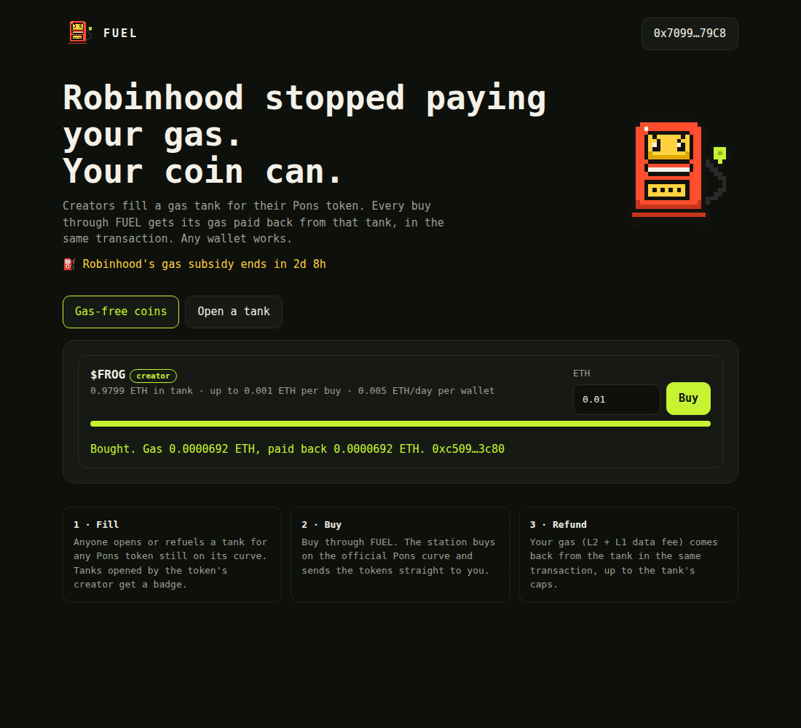

<p align="center"></p>

<h1 align="center">FUEL</h1>

<p align="center"><b>Robinhood stopped paying your gas. Your coin can.</b><br>
Gas tanks for Pons tokens on Robinhood Chain.</p>

---

For its first 90 days, Robinhood Chain paid everyone's gas. On **September 29,
2026** that subsidy ends. Every swap costs ETH again, and gas on the chain has
already spiked 25x in eleven days.

FUEL lets a coin keep its buyers gas-free:

1. **Fill.** Anyone opens a tank for a Pons V2 token and fills it with ETH:
   the creator (who earns ETH fees on every trade) or the community.
2. **Buy.** Buyers buy through FUEL. The station buys on the official Pons
   bonding curve and sends the tokens straight to the buyer.
3. **Refund.** In the same transaction, the tank pays back the buyer's gas:
   L2 execution plus the L1 data fee.

Any wallet works. It is one ordinary payable call, not a smart-account setup.

<p align="center"></p>

## Why a creator would pay for this

Their coin trades gas-free while thousands of others don't. More buys mean more
volume, and more volume means more creator fees, which is also what refills the
tank.

## Safety model

The station holds other people's ETH, so it is built to be boring:

| Risk | What the contract does |
| --- | --- |
| Arbitrary calls | None. The station only calls `buy` on the bonding curve that the **official Pons V2 factory** (`0x7eD5…EC7e`) reports for the tank's token. |
| Wash-buying a tank dry | A refund never exceeds the trade fee that buy paid to the curve (Pons fee + creator tax). Draining costs the attacker at least as much as the tank loses. |
| One wallet farming | Per-buy and per-wallet-per-day caps, set by the sponsor. |
| Padded gas price | L2 gas is refunded at `min(tx.gasprice, block.basefee)`; Arbitrum ignores tips anyway. |
| Tank blocking trades | Never. A paused, empty or capped tank just refunds less; the buy still goes through. |
| Naive gas estimates | Wallets estimate at zero gas price; if too little gas remains, the buy completes without a refund instead of reverting (`REFUND_GAS_RESERVE`). |
| Protocol owner | Can set the deposit fee (hard cap 5%), the treasury and the $FUEL boost. **Cannot** touch, pause or redirect any tank. |

Unaudited. Get an audit before holding meaningful ETH.

## Contract

`src/FuelStation.sol`

| Function | Who | What |
| --- | --- | --- |
| `openTank(token, maxRefundPerBuy, dailyCapPerWallet)` | anyone | Opens a tank for a native-ETH Pons V2 token still on its curve. Creator-opened tanks get `official = true`. ETH sent is the first fill. |
| `refuel(id)` | anyone | Adds ETH. Communities can fuel the coins they hold. |
| `buy(id, minTokensOut)` | buyers | Buys with all of `msg.value`, refunds gas. Returns `(tokensOut, refund)`. |
| `configure`, `setPaused`, `close` | sponsor | Change caps, pause, or take the rest back. |
| `refundCap(id, wallet, spend)` | view | Largest refund a buy could get right now. |

Deposits pay a protocol fee (default 2%) to the treasury. Wallets holding the
$FUEL threshold get double the daily cap on every tank.

Refund accuracy was calibrated against real receipts: ~100% of gas paid back
on first and repeat buys ([docs/CALIBRATION.md](docs/CALIBRATION.md)).

### v1 scope

- Pons V2 tokens paired with **native ETH**, while they are **on the bonding curve**.
- Not yet: graduated tokens (Uniswap v4 pools) and stock-paired curves (ERC-20 quote).

## Run it

```bash
forge test                      # 24 tests incl. fuzzing, mocks mirror PonsV2BondingCurve.buy
```

Local end-to-end on anvil, with the web app:

```bash
anvil &
forge script script/LocalDemo.s.sol --rpc-url http://127.0.0.1:8545 --broadcast \
  --private-key 0xac0974bec39a17e36ba4a6b4d238ff944bacb478cbed5efcae784d7bf4f2ff80
# serve web/ and open index.html?station=<printed>&rpc=http://127.0.0.1:8545&chainId=31337
```

Mainnet:

```bash
OWNER=0x… TREASURY=0x… forge script script/Deploy.s.sol \
  --rpc-url https://rpc.mainnet.chain.robinhood.com --broadcast --private-key $KEY
```

Then set `STATION` in `web/index.html` (or pass `?station=`). The web app is one
static file with no build step.

## Layout

```
src/FuelStation.sol          the station
src/interfaces/IPonsV2.sol   the slice of Pons V2 it uses (from ponsdotdev/ponsfamily)
test/                        Foundry tests and Pons mocks
script/Deploy.s.sol          mainnet deploy (chain 4663 only)
script/LocalDemo.s.sol       anvil playground
web/index.html               the app
mascot/                      Gus
docs/                        calibration, launch plan
```

## License

MIT
