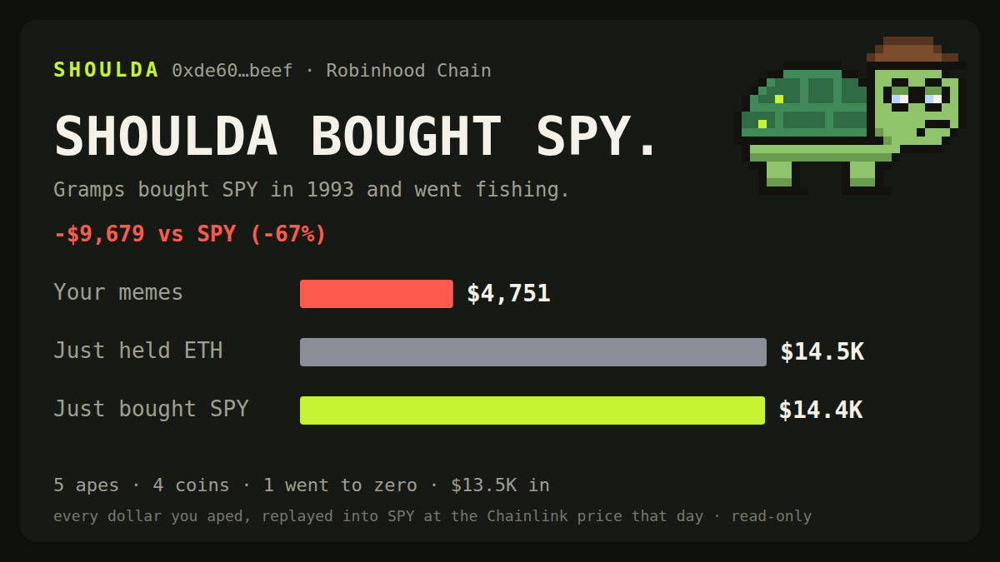

<p align="center"></p>

<h1 align="center">SHOULDA</h1>

<p align="center"><b>Your memecoin trades vs. just buying the stock.</b><br>
Every ape you made on Robinhood Chain, replayed into SPY at the Chainlink price that day.</p>

---

Robinhood Chain is the only chain where your memecoins and the S&P 500 trade side by
side: Stock Tokens are plain ERC-20s with live Chainlink feeds, one block away from the
Pons launchpad. So the question every degen avoids finally has an exact answer:

> What if every dollar I aped had gone into the index instead?

Paste a wallet. Gramps replays it.

<p align="center"></p>

## Run it

```bash
npx shoulda-cli 0xYourWallet                 # vs SPY
npx shoulda-cli 0xYourWallet --vs NVDA       # or NVDA, QQQ, TSLA
npx shoulda-cli 0xYourWallet --card me.svg   # 1200x675 share card
npx shoulda-cli demo                         # offline, made-up wallet
```

From a clone: `node bin/shoulda.mjs demo`. Node 22+, zero dependencies.

## How the replay works

For each buy of a memecoin (paid in ETH, WETH or USDG), Gramps asks two questions:

1. **What was that worth in dollars?** ETH/USD at the time of the buy.
2. **How many shares would that have bought?** The benchmark's Chainlink price at that
   same moment, read from the feed's round history on-chain.

Then all three roads are marked to today:

| Line | Meaning |
| --- | --- |
| **Your memes** | ETH/USDG you got back from sells + open bags at today's DEX price |
| **Just held ETH** | the ETH/USDG you spent, simply held |
| **Just bought SPY** | every buy redirected into the benchmark at that day's price |

Sell proceeds in ETH are marked at today's ETH price, like the "just held ETH" line, so
neither line gets a free ride.

### Historical prices without an archive node

A Chainlink proxy numbers rounds as `(phaseId << 64) | roundId` and keeps every round's
answer and timestamp forever. The price at time *T* is a binary search for the last round
updated at or before *T*: ~15 `eth_call`s, cached, walking back across phases when needed
([`src/chainlink.mjs`](src/chainlink.mjs)).

### Sources

| What | Where |
| --- | --- |
| Wallet history | Robinhood Chain Blockscout v2 (transactions, internal transactions, ERC-20 transfers, balances) |
| Stock prices, then and now | Chainlink feeds on chain 4663 via public RPC |
| ETH/USD, then | explorer daily close, or a Chainlink ETH/USD proxy via `SHOULDA_ETH_USD_FEED` |
| Bags, now | DexScreener, deepest pool per token |

Stock Token and feed addresses come from the verified registry in
[nirholas/robinhood-chain-sdk](https://github.com/nirholas/robinhood-chain-sdk) and are
listed in [`src/config.mjs`](src/config.mjs).

## What it doesn't count (on purpose)

- **Gas.** Your real number is a bit worse.
- **Exit liquidity.** Bags are marked at DEX price, not what you could actually sell for.
- **Meme-to-meme swaps and Stock Token trades.** The first has no clean dollar basis; the
  second is investing, not aping.
- **Airdrops.** Open bags are capped at what you bought, so free tokens don't pad the score.
- **Very long histories.** The explorer is crawled up to 40 pages (2,000 rows) per stream; a
  truncated history is flagged in the output.

## Safety

Read-only. No private keys, no signatures, no wallet connect, no transactions. The RPC
client can only `eth_call`. Output is arithmetic about the past, not advice.

## Environment

| Variable | Default |
| --- | --- |
| `SHOULDA_RPC` | `https://rpc.mainnet.chain.robinhood.com` |
| `SHOULDA_EXPLORER` | `https://robinhoodchain.blockscout.com` |
| `SHOULDA_ETH_USD_FEED` | unset (explorer daily close) |

## Development

```bash
npm test      # node:test, no network
npm run demo
```

```
bin/shoulda.mjs        CLI
src/trades.mjs         explorer history → buys and sells (pure)
src/verdict.mjs        the replay and Gramps' verdict (pure)
src/chainlink.mjs      price at time T via round binary search
src/explorer.mjs       Blockscout crawler with truncation guard
src/prices.mjs         ETH then/now, bags now
src/render/            terminal, share card, Gramps
```

## License

MIT
